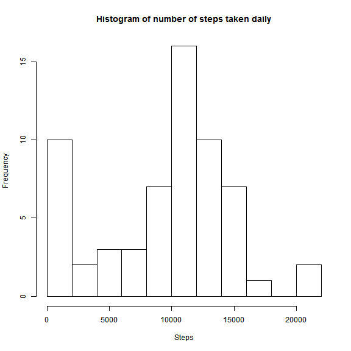
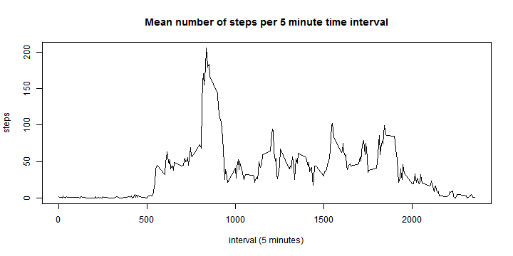

Reproducible Research: Peer Assessment 1
=========================================


## Loading and preprocessing the data

```r
library(lubridate)
activity <- read.csv("activity.csv",
                 stringsAsFactors = FALSE) # insure data is not converect to a factor
activity$date <- as.Date(activity$date)

str(activity) #show structure of data frame
```

```
## 'data.frame':	17568 obs. of  3 variables:
##  $ steps   : int  NA NA NA NA NA NA NA NA NA NA ...
##  $ date    : Date, format: "2012-10-01" "2012-10-01" ...
##  $ interval: int  0 5 10 15 20 25 30 35 40 45 ...
```

## What is mean total number of steps taken per day?

```r
range <- as.numeric(max(activity$date)-min(activity$date))
daily <- data.frame(Date = as.Date(character()),
                   Steps = numeric(),
                   invalids = numeric(),
                   stringsAsFactors = FALSE)
base.date <- min(activity$date)
for(index in 0:range){
     filter.date <- base.date + index
     work <- subset(activity, date == filter.date)
     steps <- sum(work$steps,
                  na.rm = TRUE)
     invalids <- sum(is.na(work$steps))
     temp <- data.frame(Date = filter.date,
                       Steps = steps,
                       invalids = invalids,
                       stringsAsFactors = FALSE)
     daily <- rbind(daily,temp)
}
hist(daily$Steps,
     breaks = 12,
     main="Histogram of number of steps taken daily",
     xlab="Steps")
```

 

```r
mean(daily$Steps)
```

```
## [1] 9354
```

```r
median(daily$Steps)
```

```
## [1] 10395
```

As seen above the mean is 9354.2295 and the median is 10395.
## What is the average daily activity pattern?

```r

range <- unique(activity$interval)
interval <- data.frame(interval = numeric(),
                       mean.steps = numeric(),
                       med.steps = numeric(),
                       std.steps = numeric(),
                       invalids = numeric())

for(index in seq_along(range)){
     filter <- range[index]
     work <- subset(activity, 
                    interval==filter,
                    select = steps)
     mean.steps <- mean(work$steps,
                        na.rm = TRUE)
     med.steps <- median(work$steps,
                         na.rm = TRUE)
     std.steps <- sd(work$steps,
                     na.rm = TRUE)
     invalids <- sum(is.na(work$steps))
     temp <- data.frame(interval = filter,
                        mean.steps = mean.steps,
                        med.steps = med.steps,
                        std.steps = std.steps,
                        invalids = invalids)
     interval <- rbind(interval,temp)
}

plot(x = interval$interval,
     y = interval$mean.steps,
     type = "l",
     main = "Mean number of steps per 5 minute time interval",
     xlab = "interval (5 minutes)",
     ylab = "steps")
```

 

```r

interval$interval[which.max(interval$mean.steps)]
```

```
## [1] 835
```

The 5-minute interval with the highest average number of steps is
835.
## Imputing missing values


## Are there differences in activity patterns between weekdays and weekends?
