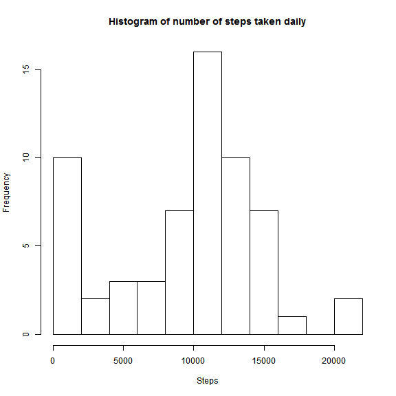
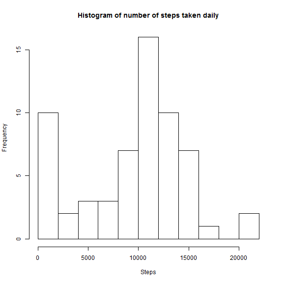
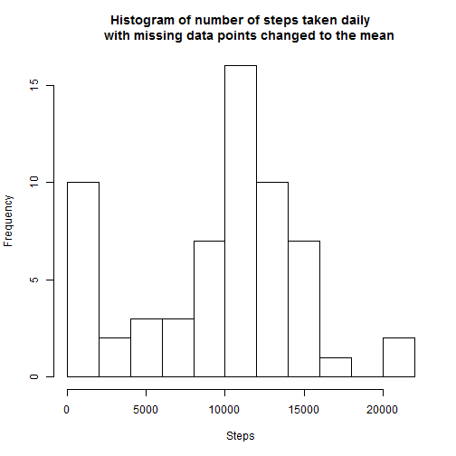
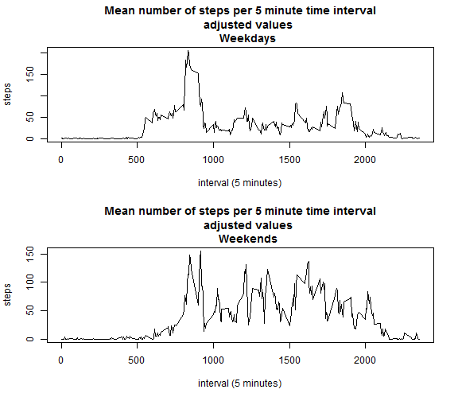

Reproducible Research: Peer Assessment 1
=========================================


## Loading and preprocessing the data

```r
library(lubridate)
activity <- read.csv("activity.csv",
                 stringsAsFactors = FALSE) # insure data is not converect to a factor
activity$date <- as.Date(activity$date)

str(activity) #show structure of data frame
```

```
## 'data.frame':	17568 obs. of  3 variables:
##  $ steps   : int  NA NA NA NA NA NA NA NA NA NA ...
##  $ date    : Date, format: "2012-10-01" "2012-10-01" ...
##  $ interval: int  0 5 10 15 20 25 30 35 40 45 ...
```

```r
summary(activity)
```

```
##      steps            date               interval   
##  Min.   :  0.0   Min.   :2012-10-01   Min.   :   0  
##  1st Qu.:  0.0   1st Qu.:2012-10-16   1st Qu.: 589  
##  Median :  0.0   Median :2012-10-31   Median :1178  
##  Mean   : 37.4   Mean   :2012-10-31   Mean   :1178  
##  3rd Qu.: 12.0   3rd Qu.:2012-11-15   3rd Qu.:1766  
##  Max.   :806.0   Max.   :2012-11-30   Max.   :2355  
##  NA's   :2304
```

## What is mean total number of steps taken per day?

```r
range <- as.numeric(max(activity$date)-min(activity$date))
daily <- data.frame(date = as.Date(character()),
                   steps = numeric(),
                   invalids = numeric(),
                   stringsAsFactors = FALSE)
base.date <- min(activity$date)
for(index in 0:range){
     filter.date <- base.date + index
     work <- subset(activity, date == filter.date)
     steps <- sum(work$steps,
                  na.rm = TRUE)
     invalids <- sum(is.na(work$steps))
     temp <- data.frame(date = filter.date,
                       steps = steps,
                       invalids = invalids,
                       stringsAsFactors = FALSE)
     daily <- rbind(daily,temp)
}
hist(daily$steps,
     breaks = 12,
     main="Histogram of number of steps taken daily",
     xlab="Steps")
```

 

```r
mean(daily$steps)
```

```
## [1] 9354
```

```r
median(daily$steps)
```

```
## [1] 10395
```

As seen above the mean is **9354.2295** steps and the median is 
**10395** steps.
## What is the average daily activity pattern?

```r

range <- unique(activity$interval)
interval <- data.frame(interval = numeric(),
                       mean.steps = numeric(),
                       med.steps = numeric(),
                       std.steps = numeric(),
                       invalids = numeric())

for(index in seq_along(range)){
     filter <- range[index]
     work <- subset(activity, 
                    interval==filter,
                    select = steps)
     mean.steps <- mean(work$steps,
                        na.rm = TRUE)
     med.steps <- median(work$steps,
                         na.rm = TRUE)
     std.steps <- sd(work$steps,
                     na.rm = TRUE)
     invalids <- sum(is.na(work$steps))
     temp <- data.frame(interval = filter,
                        mean.steps = mean.steps,
                        med.steps = med.steps,
                        std.steps = std.steps,
                        invalids = invalids)
     interval <- rbind(interval,temp)
}

plot(x = interval$interval,
     y = interval$mean.steps,
     type = "l",
     main = "Mean number of steps per 5 minute time interval",
     xlab = "interval (5 minutes)",
     ylab = "steps")
```

 

```r

interval$interval[which.max(interval$mean.steps)]
```

```
## [1] 835
```

The 5-minute interval with the highest average number of steps is
**835**.
## Imputing missing values

```r

good <- subset(activity,
               subset = !is.na(steps))
bad <- subset(activity,
              subset = is.na(steps))

#number of NA observatins
nrow(bad)
```

```
## [1] 2304
```

```r

range = nrow(bad)
for (index in 1:range){
     filter <- bad$interval[index]
     bad$steps[index] <- subset(interval, interval == filter)$med.steps
}

activity_imput <- rbind(good,bad)

range <- as.numeric(max(activity_imput$date)-min(activity_imput$date))

daily_imput <- data.frame(date = as.Date(character()),
                          steps = numeric(),
                          invalids = numeric(),
                          stringsAsFactors = FALSE)

base.date <- min(activity_imput$date)

for(index in 0:range){
     filter.date <- base.date + index
     work <- subset(activity_imput, date == filter.date)
     steps <- sum(work$steps,
                  na.rm = TRUE)
     invalids <- sum(is.na(work$steps))
     temp <- data.frame(date = filter.date,
                        steps = steps,
                        invalids = invalids,
                        stringsAsFactors = FALSE)
     daily_imput <- rbind(daily_imput,temp)
}


hist(daily_imput$steps,
     breaks = 12,
     main="Histogram of number of steps taken daily
     with missing data points changed to the mean",
     xlab="Steps")
```

 

```r
mean(daily_imput$steps)
```

```
## [1] 9504
```

```r
median(daily_imput$steps)
```

```
## [1] 10395
```

The mean total steps per day using the adjusted data is **9503.8689**
a difference of **149.6393** steps from the 
unadjusted mean of **9354.2295** steps.

The median total steps per day using the adjusted data is **10395**
a difference of **0** steps from the
unadjusted median of **10395** steps.
## Are there differences in activity patterns between weekdays and weekends?

```r
range = nrow(activity_imput)
work <- data.frame(weekend = factor(levels=c("weekday","weekend")),
                   stringsAsFactors = FALSE)

for(index in 1:range){
     hold <- weekdays(activity_imput$date[index])
     if (hold == "Saturday" | hold =="Sunday"){
          weekend = "weekend"
     } else {
          weekend = "weekday"
     }
     temp <- data.frame(weekend = as.factor(weekend),
                        stringsAsFactors = FALSE)
     work <- rbind(work,temp)     
}
activity_imput  <- cbind(activity_imput,work)

# plot weekdays
range <- unique(activity_imput$interval)
temp_weekday <- subset(activity_imput,
                       weekend == "weekday")
interval_weekday <- data.frame(interval = numeric(),
                               mean.steps = numeric(),
                               weekend = factor(levels=c("weekday","weekend")),
                               stringsAsFactors = FALSE)
temp_weekend <- subset(activity_imput,
                       weekend == "weekend")
interval_weekend <- data.frame(interval = numeric(),
                               mean.steps = numeric(),
                               weekend = factor(levels=c("weekday","weekend")),
                               stringsAsFactors = FALSE)


for(index in seq_along(range)){
     filter <- range[index]
     work <- subset(temp_weekday, 
                    interval==filter)
     
     mean.steps <- mean(work$steps,
                        na.rm = TRUE)

     temp <- data.frame(interval = filter,
                        mean.steps = mean.steps,
                        weekend = as.factor(work$weekend))
     interval_weekday <- rbind(interval_weekday, temp)
}

for(index in seq_along(range)){
     filter <- range[index]
     work <- subset(temp_weekend, 
                    interval==filter)
     
     mean.steps <- mean(work$steps,
                        na.rm = TRUE)

     temp <- data.frame(interval = filter,
                        mean.steps = mean.steps,
                        weekend = as.factor(work$weekend))
     interval_weekend <- rbind(interval_weekend, temp)
}


par(mfrow=(c(2,1)))

plot(x = interval_weekday$interval,
     y = interval_weekday$mean.steps,
     type = "l",
     main = "Mean number of steps per 5 minute time interval
     adjusted values
     Weekdays",
     xlab = "interval (5 minutes)",
     ylab = "steps")
              
plot(x = interval_weekend$interval,
     y = interval_weekend$mean.steps,
     type = "l",
     main = "Mean number of steps per 5 minute time interval
     adjusted values
     Weekends",
     xlab = "interval (5 minutes)",
     ylab = "steps")
```

 

```r
     
```


